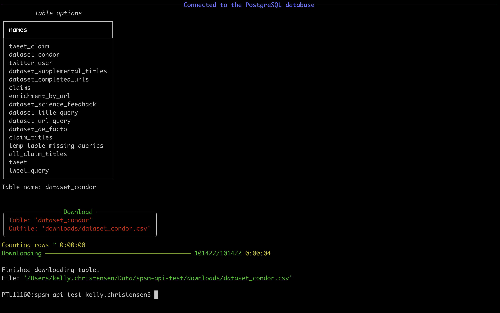
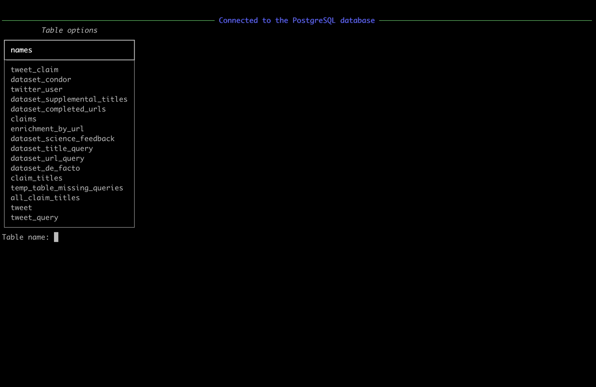

# SPSM Database API

Command-line tool for downloading data from the SPSM project's PostgreSQL database server.

## Table of contents

- [Installation](#install-the-tool)
- [Downloading from remote database](#remote-postgresql-database-for-export)
  - [Download an entire table](#download-an-entire-table)
  - [Download part of a table](#download-select-columns-from-a-table)
- [Working with data locally](#local-duckdb-database-for-analysis)
  - [Execute SQL file](#execute-query)

## Install the tool

1. Create a virtual Python environment with version 3.11 of Python.
2. Activate the environment.
3. With the environment activated, install this tool using the following command:

```shell
pip install https://github.com/medialab/spsm-database-api.git
```

4. Test your installation with the following command:

```console
$ spsm --help
```

## Download data

For downloading data from the project's secure PostgreSQL server, you'll need two things:

1. A terminal running in the background, in which the remote PostgreSQL server's port is being rerouted to your computer's port 54321.
2. A user profile on the server, which has been granted permissions to select from tables.

Start downloading with `spsm download SUBCOMMAND`. After which, the terminal will prompt you to enter information necessary for all data downloads.


If you don't want to be prompted, you can enter the information directly as options after `spsm download`.

```
$ spsm download --username 'YOUR.USERNAME' --password YOUR-PASSWORD --download-directory /PATH/TO/FILE.csv SUBCOMMAND
```

### Download an entire table

To download an entire table onto your computer and/or disk, run the following command:

```console
$ spsm download table
```

As described above, the terminal will prompt you to enter the information necessary for all types of data download.

Then you will be prompted to enter the name of the table you want to download.



If you don't want to be prompted, you can enter the information with options.

```console
$ spsm download --username 'YOUR.USERNAME' --password YOUR-PASSWORD --download-directory /PATH/TO/FILE.csv table --table TABLE_NAME
```

### Download select columns from a table

To download an entire table onto your computer and/or disk, run the following command:

```console
$ spsm download columns
```

First, as in the [`spsm download table`](#download-an-entire-table) command, the terminal will prompt you to enter the name of the table you want to download.

Then, you'll be asked to begin entering the columns you want to download.



## Local DuckDB database (for analysis)

DuckDB is another SQL database manager, different from PostgreSQL. Wherease PostgreSQL is good for storing data, especially on a server, DuckDB is excellent at excuting queries. It's much faster than PostgreSQL and it's what's called an "embedded" system, like SQLite, which means it stores all of the database in a single file. Contrary to PostgreSQL, DuckDB doesn't use a server.

For these reasons, it's a great solution for locally working with tables downloaded from the remote database. You can either save your work in a DuckDB database by saving it to a file on your computer, or you can work within your computer's memory and not generate any new files. The latter might be nice for quick queries using files you've downloaded, but once your query is done the database will disappear.

All of the `spsm local` commands require you to choose between creating a DuckDB database file or using your computer's memory. To do the first, provide the path to where you want this tool to generate a DuckDB file. A good file name is something like `spsm.duckdb`. To do the second, press `Enter` when prompted, which will use the default in-memory database.

```console
$ spsm local COMMAND
Path to the local DuckDB database. If you want to
process everything in memory, without creating a
file, press enter for the default path ":memory:".
     [:memory:]:
```

Once you've connected to the local DuckDB database, you'll be asked to start importing some of the CSV files you downloaded from the server / have locally on your computer.

```console
Do you want to create a table form a CSV file? [y/N]: y
```

You'll then be asked to provide (1) the name you want to give the table and (2) the path to the file from which you want to build the table.

```console
Do you want to create a table form a CSV file? [y/N]: y
Table name: claims
File path: downloads/claims_2023-11-15.csv.gz
```

This will insert a CSV file with headers and a comma as the delimiter.

### Execute query
