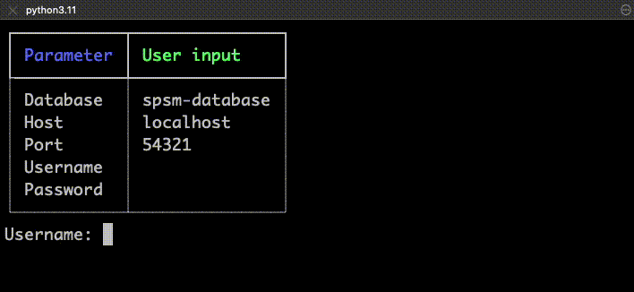
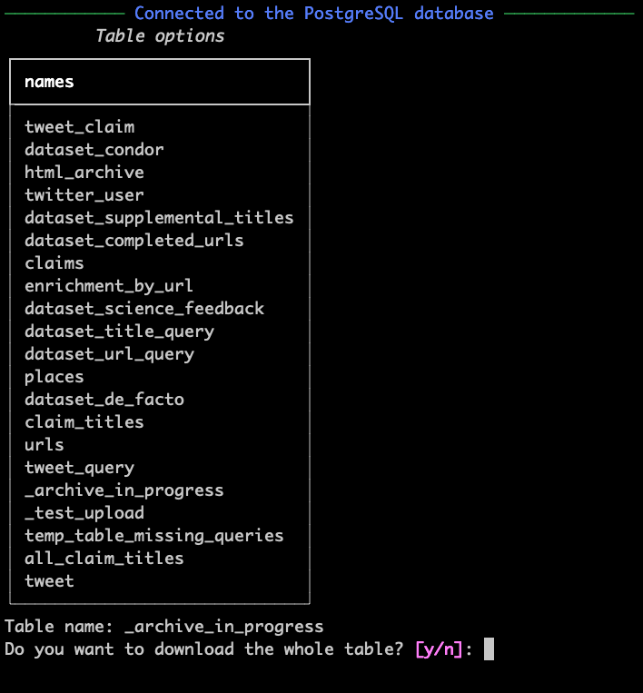
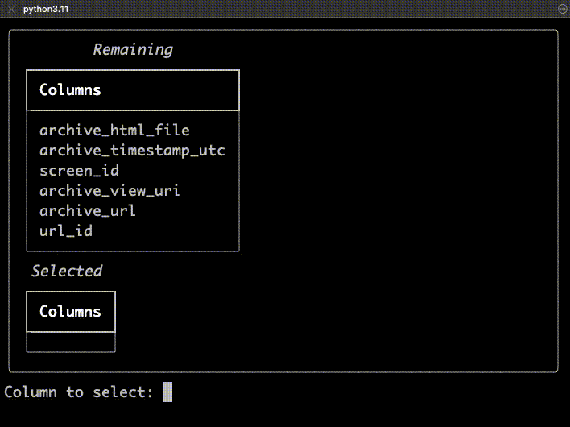
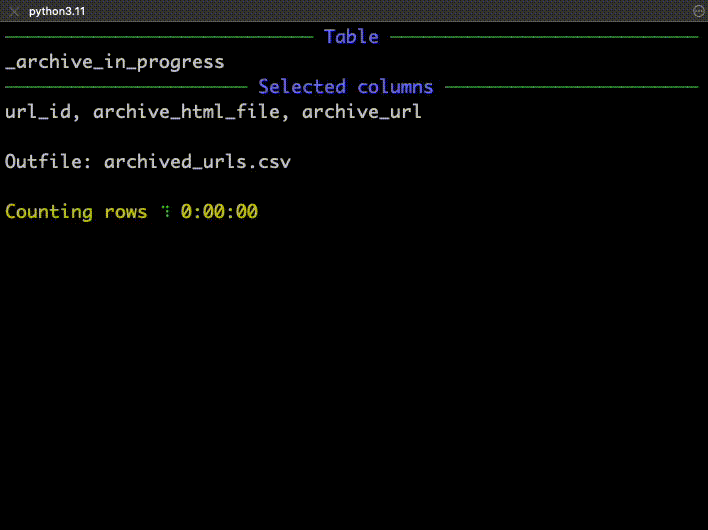

# SPSM Database API


Command-line tool for downloading data from the SPSM project's PostgreSQL database server.

## Table of contents

- [Installation](#install-the-tool)
- [Downloading from remote database](#download-data)

## Install the tool

1. Create a virtual Python environment with version 3.11 of Python.
2. Activate the environment.
3. With the environment activated, install this tool using the following command:

```console
$ pip install git+https://github.com/medialab/spsm-database-api.git
```

4. Test your installation with the below command. (It's normal if it takes 1-2 seconds for the tool to boot up / respond.)

```console
$ spsm --help
```

```
Usage: spsm [OPTIONS] COMMAND [ARGS]...

Options:
  --database TEXT
  --host TEXT
  --port INTEGER
  --username TEXT
  --password TEXT
  --help           Show this message and exit.

Commands:
  download
  upload
```

## Download data

For downloading table data from the project's PostgreSQL server, you'll need two things:

1. A terminal running in the background, in which the remote PostgreSQL server's port is being forwarded to a port on your computer. (The default forwarded port is `54321`.)
2. A user profile on the server, which has been granted permissions to select from tables.

### Be Prompted

The simplest way to get started is to enter the command `spsm download` and let the tool guide you through configuring all the options.

1. First, the terminal will prompt you to enter your login credentials, in order to connect to the remote server.



2. Once connected, you will be presented with a list of the tables in the database and prompted to enter the name of the table you want to download.

3. Then, you will be asked if you want to download the entire table or only certain columns from the table.



4. If you entered `n` for "no," meaning you want to download only part of the table / some of its columns, you will be presented with a list of the table's columns and prompted to select which ones you want to include in your download.

> _Note: Downloading only some of the columns is helpful if, for example, the table has a text column that you're not interested in analyzing at the moment. By not selecting the text column, and only selecting the relevant columns, your download will go faster._



5. Finally, you'll be reminded of your choices and prompted to provide a path to the CSV file in which you want to write the downloaded table.



That's it! :tada: You downloaded a table from the remote server onto your local computer.

---

### One Line

If you don't want to be prompted, you can enter all the information directly as options after `spsm download`. However, this only works if you're downloading the entire table, which you signify with the flag `--select-all`. Otherwise, you'll still be prompted to confirm which columns you want to select.

```shell
$ spsm --username "YOUR.USERNAME" --password "YOUR-PASSWORD" download --table "TABLE-NAME" --select-all --outfile "OUTFILE"
```

---
