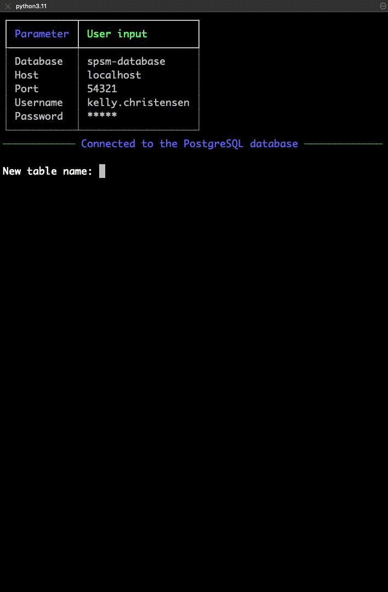
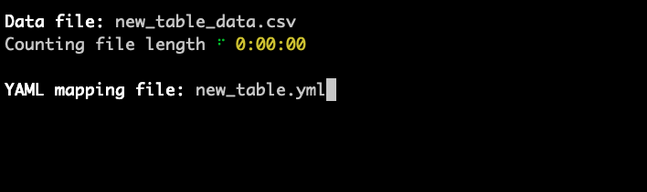
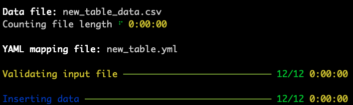

# SPSM Database API


Command-line tool for downloading data from the SPSM project's PostgreSQL database server.

## Table of contents

- [Installation](#install-the-tool)
- [Download: server -> your computer](#download-data)
- [Upload: your computer -> server](#upload-data)

## Install the tool

1. Create a virtual Python environment with version 3.11 of Python.
2. Activate the environment.
3. With the environment activated, install this tool using the following command:

```console
$ pip install git+https://github.com/medialab/spsm-database-api.git
```

4. Test your installation with the below command. (It's normal if it takes 1-2 seconds for the tool to boot up / respond.)

```console
$ spsm --help
```

```
Usage: spsm [OPTIONS] COMMAND [ARGS]...

Options:
  --database TEXT
  --host TEXT
  --port INTEGER
  --username TEXT
  --password TEXT
  --help           Show this message and exit.

Commands:
  download
  upload
```

## Connection

For all data transfers to and from the project's PostgreSQL server, you'll need two things:

1. A terminal running in the background, in which the remote PostgreSQL server's port is being forwarded to a port on your computer. (The default forwarded port is `54321`.)
2. A user profile on the server, which has been granted permissions to select from tables.

Then, once you launch one of the tool's commands (`spsm download` or `spsm upload`), you'll be prompted to input your connection details.


## Download data

### Be Prompted

The simplest way to get started is to enter the command `spsm download` and let the tool guide you through configuring all the options.

2. Once connected, you will be presented with a list of the tables in the database and prompted to enter the name of the table you want to download.

3. Then, you will be asked if you want to download the entire table or only certain columns from the table.


4. If you entered `n` for "no," meaning you want to download only part of the table / some of its columns, you will be presented with a list of the table's columns and prompted to select which ones you want to include in your download.

> _Note: Downloading only some of the columns is helpful if, for example, the table has a text column that you're not interested in analyzing at the moment. By not selecting the text column, and only selecting the relevant columns, your download will go faster._


5. Finally, you'll be reminded of your choices and prompted to provide a path to the CSV file in which you want to write the downloaded table.


That's it! :tada: You downloaded a table from the remote server onto your local computer.

---

### One Line

If you don't want to be prompted, you can enter all the information directly as options after `spsm download`. However, this only works if you're downloading the entire table, which you signify with the flag `--select-all`. Otherwise, you'll still be prompted to confirm which columns you want to select.

```shell
$ spsm --username "YOUR.USERNAME" --password "YOUR-PASSWORD" download --table "TABLE-NAME" --select-all --outfile "OUTFILE"
```

---

## Upload data

Using this tool, you can create a new table in the database from a CSV file that you have locally on your computer.

> _Note: To alter and/or update existing tables with new data, you'll need more complex SQL that this tool isn't designed to manage._

### Getting started

Before you upload your new table data, you'll need to declare what type of data is in each column, as well as which column contains unique values and is never empty, in other words, it can serve as the table's "primary key".

This declaration needs to written in a user-friendly file format called YAML, and it needs to contain 2 root-level items: the table's primary key (`pk`) and the table's columns (`columns`). Follow the example below, noting that each of the pairs of column name and data type under `columns` is indented with 2 spaces.

`table-schema.yml`

```yaml
pk: id
columns:
  id: int
  name: string
  date: datetime
```

In the YAML file, you'll need to (a) list every column in your CSV file / future new table, and (b) assign one of the following data types to the column:

- `int` or `integer`
- `text`
- `varchar(N)` (the N represents an integer, denoting the length of the varying characters, e.g. `varchar(20)`)
- `float`
- `bool` or `boolean`
- `date`
- `datetime`
- `interval`

### Be Prompted

The simplest way to upload a new table is to enter the command `spsm upload`.

1. First, as with downloading data, you'll connect to the database.

2. Once connected, you'll be prompted to name your new table.

   - Table names must begin with an underscore or a letter. They cannot begin with a number. In the SPSM database, tables names are consistently written in "snake case," meaning underscores separate words.

   - If the table name you want to use is already in use, you'll be asked if you want to delete the existing table. _**If you have the permission**_ to delete the existing table (i.e. if you previously created it, for your own analytical needs), you'll be asked for a second and final time if you want to delete it. If again you say yes (`y`), your preferred table name will be used to create a new table.



3. Once your table name is validated, you'll be prompted to give the name of the CSV file and the YAML configuration file that you've prepared in advance.



That's it! :tada: Once you've entered the file names, the tool will run some preliminary tests of the data you've input then it will try to upload it into the database. The validation tests include (a) making sure your YAML configuration file named all the columns that the tool identified in the CSV, and (b) making sure the primary column, which you declared in the YAML configuration file, does not have any cells that are empty in the CSV file.



The validation tests do not include checking to see that the data you've included in the CSV file matches the data types you declared in the YAML configuration file. If this is the case, it's likely the script will crash with an `sqlalchemy.exc.StatementError`. For the moment, the only solution is to be more careful about making sure the data in the CSV looks like / can be parsed as the data types declared in the YAML configuration file.
